# labspy05

# Latihan

# Latihan yang pertama adalah membuat daftar kontak dengan menggunakan dictionary pada python
- berikut gambaran source code nya:
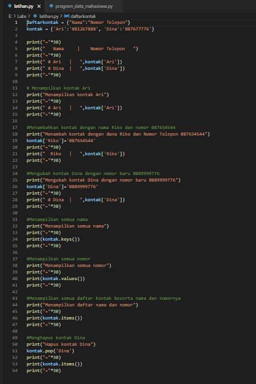

Dengan penjelasan source code sebagai berikut:

- Dibawah ini adalah untuk menampung data dari dictionary

```python
daftarkontak = {"Nama":"Nomor Telepon"}
kontak = {'Ari':'081267888', 'Dina':'087677776'}
```

- Sedangkan code dibawah adalah untuk mengakses atau menampilkan kontak yang telah ditampung dalam data dictionary tersebut
```python
print("="*30)
print("   Nama     |    Nomor Telepon   ")
print("="*30)
print(" # Ari   |   ",kontak['Ari'])
print(" # Dina  |   ",kontak['Dina'])
print("="*30)
```
- berikut hasil programnya:
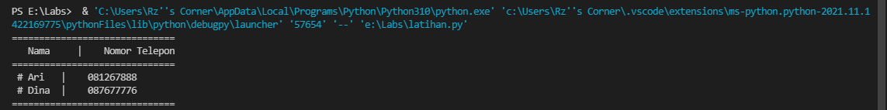

- Code dibawah ini adalah untuk menampilkan salah satu dari daftar kontak yang ada, dibawah yang akan di tampilkan adalah daftar kontak Ari

```python 
print("Menampilkan kontak Ari")
print("="*30)
print(" # Ari   |   ",kontak['Ari'])
print("="*30)
```
- berikut hasil programnya:
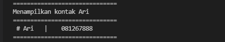

- Code dibawah ini untuk menambahkan kontak dengan nama Riko dan nomor 087654544
```python
print("Menambah kontak dengan dana Riko dan Nomor Telepon 087654544")
kontak['Riko']='087654544'
print("="*30)
print("  Riko   |   ",kontak['Riko'])
print("="*30)
```
- berikut hasil programnya:
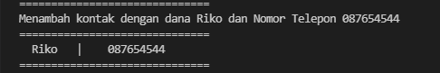

- Code dibawah untuk mengubah kontak Dina dengan nomor baru 0889999776
```python
print("Mengubah kontak Dina dengan nomor baru 0889999776")
kontak['Dina']='0889999776'
print("="*30)
print(" # Dina  |   ",kontak['Dina'])
print("="*30)
```
- berikut hasil programnya:
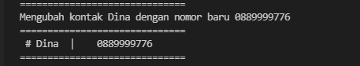

- Code dibawah untuk menampilkan semua nama yang ada dalam daftar kontak
```python
print("Menampilkan semua nama")
print("="*30)
print(kontak.keys())
print("="*30)
```
- berikut hasil programnya:
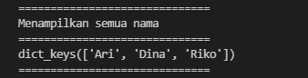

- Code berikut untuk menampilkan semua nomor yang ada dalam daftar kontak
```python
print("Menampilkan semua nomor")
print("="*30)
print(kontak.values())
print("="*30)
```
- berikut hasil programnya:
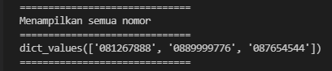

- Code berikut untuk menampilkan semua daftar kontak beserta nama dan nomornya
```python
print("Menampilkan daftar nama dan nomor")
print("="*30)
print(kontak.items())
print("="*30)
```
- berikut hasil programnya:
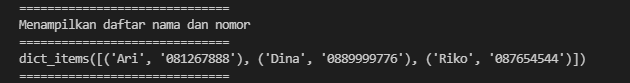

- Code dibawah untuk menghapus kontak Dina yang tersimpan dalam daftar kontak
```python
print("Hapus kontak Dina")
kontak.pop('Dina')
print("="*30)
print(kontak.items())
print("="*30)
```
- berikut hasil programnya:
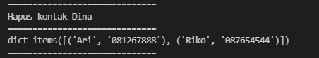

# Praktikum

- Dibawah ini adalah program sederhana untuk membuat daftar nilai mahasiswa dengan menggunakan dictionary, dan menampilkan pilihan menu tambah, ubah, cari, hapus, dan lihat

- berikut gambaran code source nya:
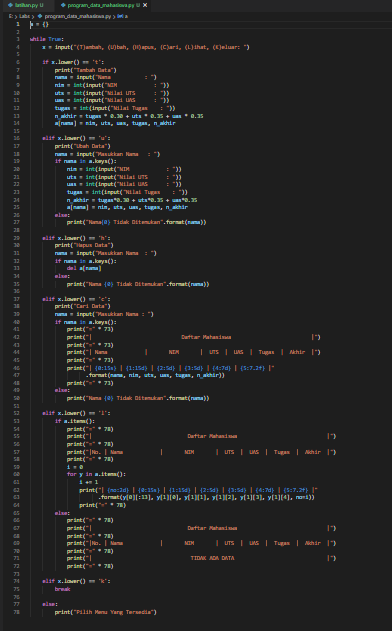

- berikut dengan flowchart programnya:


- Dengan penjelasan source code sebagai berikut:

- Code dibawah ini untuk membuat dictionary kosong, untuk menampung dictionary dengan menggunakan tuple
```python
a = {}
```
-  Code dibawah ini untuk perulangan while, dan juga untuk menginisialkan penambahan menu pilihan Tambah, Ubah, Hapus, Cari, Lihat dan Keluar:
```python
while True:
    x = input("(T)ambah, (U)bah, (H)apus, (C)ari, (L)ihat, (K)eluar: ")
```
- Code dibawah adalah untuk syntax penambahan data, dengan ketentuan jika kita mengetikkan 't' pada keyboard, maka akan melakukan penambahan data dan ditampung kedalam dictionary 'a' yang telah kita buat, dengan nama sebagai keys, dan yang lainnya sebagai values
  ```python
    if x.lower() == 't':
        print("Tambah Data")
        nama = input("Nama           : ")
        nim = int(input("NIM            : "))
        uts = int(input("Nilai UTS      : "))
        uas = int(input("Nilai UAS      : "))
        tugas = int(input("Nilai Tugas    : "))
        n_akhir = tugas * 0.30 + uts * 0.35 + uas * 0.35
        a[nama] = nim, uts, uas, tugas, n_akhir
```
- Code dibawah adalah untuk syntax mengubah data, dengan ketentuan jika kita mengetikkan 'u' pada keyboard, maka akan melakukan perubahan data yang telah di tampung ke dalam dictionary 'a' yang telah kita buat, tetapi data yang dapat diubah hanya data yang berupa values nya saja
  ```python
    elif x.lower() == 'u':
        print("Ubah Data")
        nama = input("Masukkan Nama   : ")
        if nama in a.keys():
            nim = int(input("NIM            : "))
            uts = int(input("Nilai UTS      : "))
            uas = int(input("Nilai UAS      : "))
            tugas = int(input("Nilai Tugas    : "))
            n_akhir = tugas*0.30 + uts*0.35 + uas*0.35
            a[nama] = nim, uts, uas, tugas, n_akhir
        else:
            print("Nama{0} Tidak Ditemukan".format(nama))
```
- Code dibawah adalah untuk syntax penghapusan data, dengan ketentuan jika kita mengetikkan 'h' pada keyboard, maka akan melakukan penghapusan data yang telah kita masukkan kedalam dictionary 'a' yang telah kita buat dengan statemen del a[nama]
 ```python
    elif x.lower() == 'h':
        print("Hapus Data")
        nama = input("Masukkan Nama  : ")
        if nama in a.keys():
            del a[nama]
        else:
            print("Nama {0} Tidak Ditemukan".format(nama))
```
- Code dibawah adalah untuk syntax pencarian data, dengan ketentuan jika kita mengetikkan 'c' pada keyboard, maka akan melakukan pencarian data dengan memasukkan keys dari data yang telah kita masukkan kedalam dictionary 'a' yang telah kita buat
  ```python
    elif x.lower() == 'c':
        print("Cari Data")
        nama = input("Masukkan Nama : ")
        if nama in a.keys():
            print("=" * 73)
            print("|                             Daftar Mahasiswa                          |")
            print("=" * 73)
            print("| Nama            |       NIM       |  UTS  |  UAS  |  Tugas  |  Akhir  |")
            print("=" * 73)
            print("| {0:15s} | {1:15d} | {2:5d} | {3:5d} | {4:7d} | {5:7.2f} |"
                  .format(nama, nim, uts, uas, tugas, n_akhir))
            print("=" * 73)
        else:
            print("Nama {0} Tidak Ditemukan".format(nama))
```
- Code dibawah adalah untuk syntax melihat data, dengan ketentuan jika kita mengetikkan 'l' pada keyboard, maka akan menampilkan keseluruhan dari data yang telah kita masukkan dan ditampung ke dalam dictionary 'a' yang telah kita buat
  
  ```python
    elif x.lower() == 'l':
        if a.items():
            print("=" * 78)
            print("|                               Daftar Mahasiswa                             |")
            print("=" * 78)
            print("|No. | Nama            |       NIM       |  UTS  |  UAS  |  Tugas  |  Akhir  |")
            print("=" * 78)
            i = 0
            for y in a.items():
                i += 1
                print("| {no:2d} | {0:15s} | {1:15d} | {2:5d} | {3:5d} | {4:7d} | {5:7.2f} |"
                      .format(y[0][:13], y[1][0], y[1][1], y[1][2], y[1][3], y[1][4], no=i))
                print("=" * 78)
 ```
- Code dibawah adalah untuk menampilkan 'TIDAK ADA DATA', jika kita belum pernah memasukkan data kedalam dictionary 'a'
  ```python
        else:
            print("=" * 78)
            print("|                               Daftar Mahasiswa                             |")
            print("=" * 78)
            print("|No. | Nama            |       NIM       |  UTS  |  UAS  |  Tugas  |  Akhir  |")
            print("=" * 78)
            print("|                                TIDAK ADA DATA                              |")
            print("=" * 78)
```
- sedangkan code dibawah adalah untuk syntax keluar dari program, untuk menghentikan program, dengan ketentuan jika kita mengetikkan 'k' pada keyboard, maka akan keluar dari program tersebut
  ```python
    elif x.lower() == 'k':
        break
Dan code yang terakhir adalah untuk syntax jika kita mengetikkan pada keyboard selain dari huruf yang telah di definisikan di atas seperti 't', 'u', 'h', 'c', 'l', dan 'k', maka akan menampilkan Pilih Menu Yang Tersedia
    else:
        print("Pilih Menu Yang Tersedia")
  ```
# Berikut hasil program praktikum, jika programnya di jalankan

- Menambahkan Data dengan syntax 't' dan melihat data dengan syntax 'l'
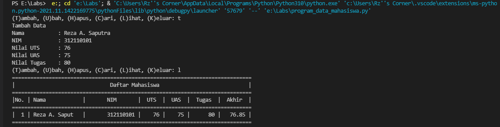

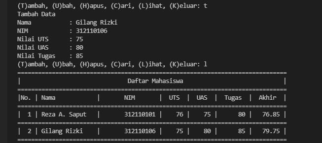

- Mengubah data dengan syntax 'u', dan melihat data dengan syntax 'l'
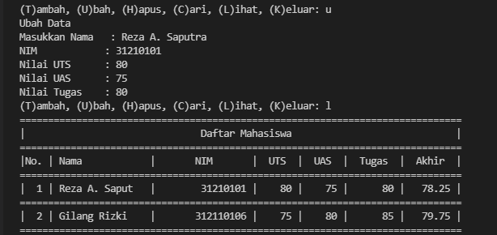

- Mencari data dengan syntax 'c', dan melihat data dengan syntax 'l'


- Menghapus data dengan syntax 'h' dan melihat data dengan syntax 'l'
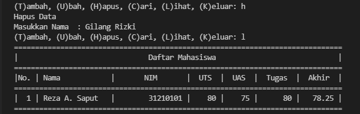

- Keluar dari program dengan syntax 'k'


# Sekian praktikum modul 5 dengan penggunaan dictionary pada python ini saya buat. Terima Kasih
